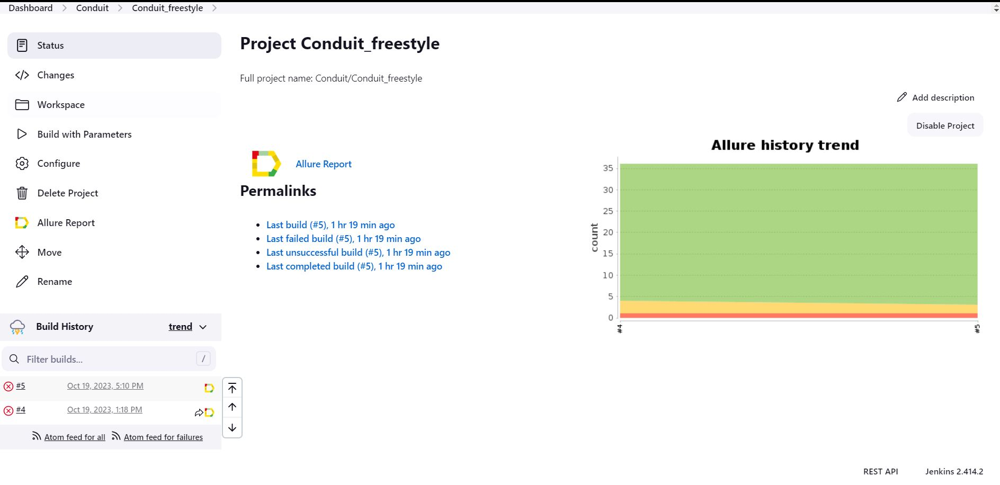
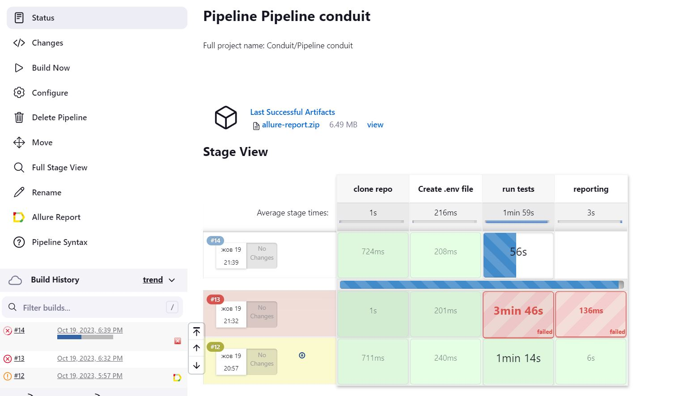
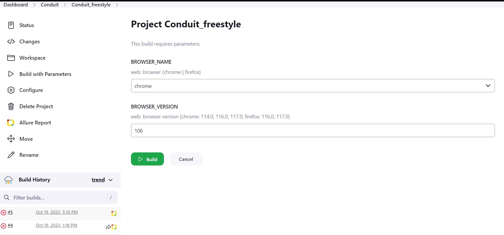
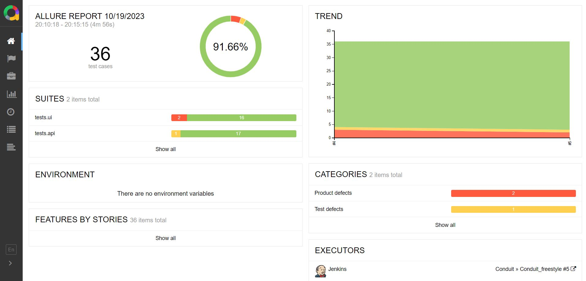
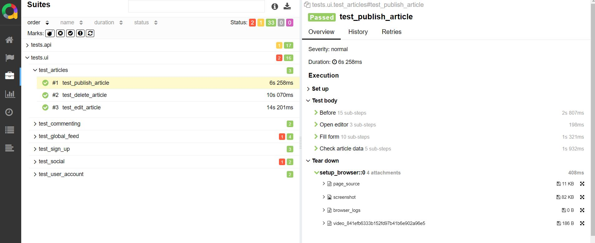
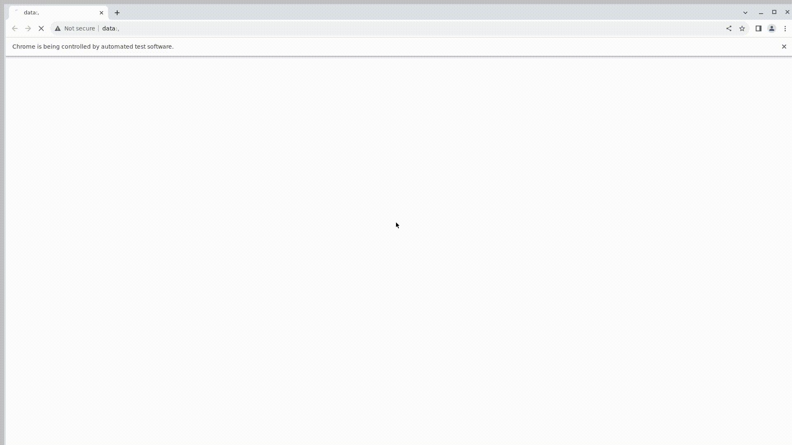
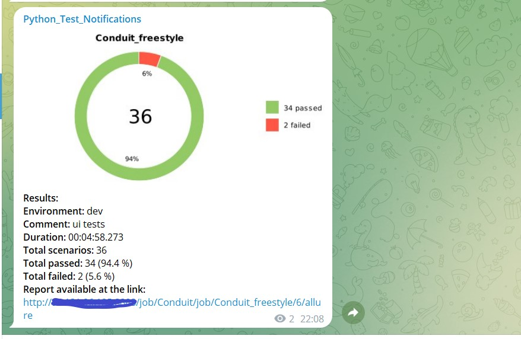

# Project on test automation in Python + Selene. 
https://demo.realworld.io/

<br>


## The following functionality is covered
# UI test cases
(https://demo.realworld.io/)

https://realworld-docs.netlify.app/docs/specs/frontend-specs/routing/

Sign up
  * ✅ [Register user](test_cases/register_user.md)
  * ✅ [Login user](test_cases/login_user.md)
  * ✅ [Logout user](test_cases/logout_user.md)

Articles 
  * ✅ [Publish article](test_cases/articles/publish_article.md)
  * ✅ [Delete article](test_cases/articles/delete_article.md)
  * ✅ [Edit article](test_cases/articles/edit_article.md)

Global feed
  * ✅ [Display article list](test_cases/articles/global_feed/display_article_list.md)
  * ✅ [Open article detail page](test_cases/articles/global_feed/open_article_detail_page.md)
  * ✅ [Like article](test_cases/articles/global_feed/like_article.md)
  * ✅ [Navigate in list by paging](test_cases/articles/global_feed/navigate_in_list_by_paging.md)
  * ✅ [Filter articles by tag](test_cases/articles/global_feed/filter_articles_by_tag.md)

Commenting
  * ✅ [Add comment](test_cases/add_comment.md)
  * ✅ [Delete comment](test_cases/delete_comment.md)

Social
  * ✅ [Subscribe to user](test_cases/subscribe_to_user.md)
  * ✅ [Personal articles feed](test_cases/personal_article_feed.md)
  * ✅ [Unsubscribe from user](test_cases/unsubscribe_from_user.md)

User account
  * ✅ [Edit settings](test_cases/edit_settings.md)
  * ✅ [Change password](test_cases/change_password.md)

<br>

# API tests
https://realworld-docs.netlify.app/docs/specs/frontend-specs/swagger/

Articles
  * ✅ Get recent articles from users you follow
  * ✅ Get recent articles globally
  * ✅ Create an article
  * ✅ Get an article
  * ✅ Update an article
  * ✅ Delete an article

Comments
  * ✅ Get comments for an article
  * ✅ Create a comment for an article
  * ✅ Delete a comment for an article

Favorites
  * ✅ Favorite an article
  * ✅ Unfavorite an article

Profile
  * ✅ Get a profile
  * ✅ Follow a user
  * ✅ Unfollow a user

Tags
  * ✅ Get tags
  
User and Authentication
  * ✅ Login for existing user
  * ✅ Register a new user
  * ✅ Get current user
  * ✅ Update current user 


## The project was implemented using

<p  align="center">
  <code></code>
  <code></code>
  <code></code>
  <code></code>
  <code></code>
  <code></code>
  <code></code>
  <code></code>
  <code></code>
  <code></code>
  <code></code>
  <code></code>
</p>
<br>

<br>

#  Autotests are run on the Jenkins server
freestyle project with the following settings
<p align="center">

</p>
<br>

Pipeline project with the following settings
<p align="center">

</p>
<br>

##  The build parameters in Jenkins:

* TESTS_FOLDER  (Selecting the folder to run the tests)
* BROWSER_VERSION (browser version, the default is 106.0)

<p align="center">

</p>
<br>

## Running tests

Local Launch:
```
pytest .
```

Remote launch:
```
python3 -m venv .venv
. .venv/bin/activate
pip install -r requirements.txt
pytest --${BROWSER_NAME} --browser_version=${BROWSER_VERSION}
```
<br>

#  Allure
> Allure Framework is an easy and flexible multi-language test report tool that not only shows a very concise representation of what have been tested in a neat web report form, but it also gives each team member a possibility to extract maximum of useful information from tests execution.

## Allure overview
> Different charts, metrics and statistics to analyze tests results easily
<p  align="left">
<code>

</code>
</p>

## Allure test result
> Here are the results of test execution.  
<p align="center">

</p>
<br>


## Allure video result
> An example of a short video how web tests are executed on Selenoid server
<p  align="left">
<code>

</code>
</p>
<br>


#  Telegram notification
> Test results notifications to be sent to the specific telegram channel by the telegram bot
<p align="center">

</p>
